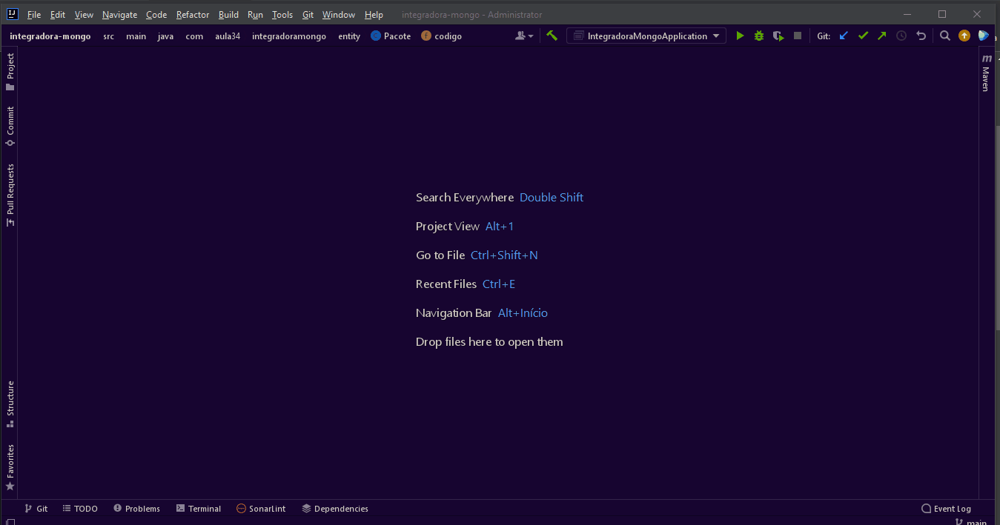

  

<h1 align="center">Desafio Academia Cagemini - 2022<h1>
 
  
  <a href="#sobre"> • Sobre</a> 
  <a href="#documentacao"> • Documentação</a> 
  <a href="#tecnologias"> • Tecnologias</a> 
  <a href="#testes"> • Testes</a> 
  <a href="#pre-requisitos">&nbsp; &nbsp; &nbsp; * Pré-Requisitos</a> 
  <a href="#como-executar">&nbsp; &nbsp; &nbsp; * Como executar</a> 
  <a href="#autor"> • Autor</a>

<h2 id="sobre">Sobre 📗</h2>

Resolução de desafios do processo seletivo da Academia Capgemini - 2022

 
  
<h2 id="documentacao">Documentação 🗎</h2>
  
  
Para acessar a documentação abra em um naveador o arquivo index.html que está presente na raiz do projeto

   

<h2 id="tecnologias">Tecnologias 🛠️</h2>
  

Para desenvolvimeto das soluções foram utilizadas as seguintes tecnologias:

  
<ul>
  <li>Linguagem: <a href="https://www.oracle.com/java/technologies/downloads/">Java 17 </a></li>
  <li>Automação e gerenciamento do projeto: <a href="https://maven.apache.org/">Maven</a></li>
  <li>Framework de testes: <a href="https://junit.org/junit5/">JUnit 5</a></li>
  <li>Biblioteca Java para elevar produtividade e reduzir verbosidade: <a href="https://projectlombok.org/">Projeto Lombok</a></li>
</ul>
 

<h2 id="testes">Testes 🧪</h2>

Os testes foram implementados seguindo modelo TDD - Test Driven Development, em português: Desenvolvimento guiado por testes.

Como o nome já sugere, um código que é desenvolvido com essa técnica tem primeiramente implementados seus casos de testes, os quais devem falhar já que não temos nunhuma 
funcionalidade criada ainda. Após essa etapa, escrevemos o código com as funcionalidades pretendidas e os requsitos 
mínimos para que, quando reaplicarmos os testes, dessa vez 
termos resultados positivos, então podemos assim refatorar e deixar o código mas limpo e performático.

Para cada unidade de código criada temos casos de teste positivos (quando o resultado esperado deve ser obtido) e 
casos de teste negativos (quando o resultado obtido deve ser diferente do esperado).

 

<h3 id="pre-requisitos">Pré-requisitos ⚙</h3>

Para executar o código que foi desenvolvido se atente em ter instalado em sua sua máquina: Java JDK 17 (versão LTS atual) e um editor código.
 *Estarei utilizando o IntelliJ para exemplificação, porém você pode utilizar a IDE de sua preferência e executar os 
testes.

 

<h3 id="como-executar">Como executar 🎲</h3>

<ul>
  <li>
    
Outra IDE

      <ol>
        <li>Clone este repositório: $ git clone https://github.com/jardel978/desafio-capgemini2022.git;</li>
        <li>Abra o projeto clonado em sua IDE e caso ela não faça automaticamente, não se esqueça de baixar as 
        dependências por meio do Maven;
        </li>
        <li>Se dirija até o diretório em que estão contidos os testes: src/test/java/testes escolha o arquivo de teste pretendido, abra-o e o execute.
         *entre esses arquivos temos o TesteSuiteUm.java. Esse consiste numa suite de testes com a qual você poderá 
        executar todos os casos de testes programados facilmente e 
        de uma só vez!
        </li>
      </ol>
  </li>
   
  
  <li>
    
IntelliJ

      <ol>
        <li>Clone este repositório: $ git clone https://github.com/jardel978/desafio-capgemini2022.git;</li>
        <li>Abra a IDE e selecione: File -> New -> Project From Existing Sources;</li>
        <li>Selecione o arquivo pom.xml que se enconta na raiz do diretório do projeto que foi clonado e clique em OK.
        A IDE irá abrir o projeto e baixar as depend6encias necessárias;
        </li>
        <li>Vá até a pasta testes seguindo o caminho: src/test/java/testes, escolha o arquivo de teste que quer 
executar e execute-o.  Para executar basta
        clicar com o botão direito do mouse sobre o código e selecionar a opção Run'classe de teste escolhida' ou Run'método específico de uma classe escolhido';.
         *entre esses arquivos temos o TesteSuiteUm.java. Esse consiste numa suite de testes com a qual você poderá 
executar todos os casos de testes programados facilmente e 
        de uma só vez! Para executar essa suite siga os mesmos passos informados acima.
        </li>
      </ol>
  </li>
</ul>
 

Vídeo para melhores explicações?

  
<h2 id="autor">Autor 👨‍💻</h2>

<a href="https://github.com/jardel978">
 
  
 <b>Jardel Oliveira</b></a> <a href="https://www.linkedin.com/in/jardel-silva-oliveira-b9a330213/" title="linkedin">🚀✨</a>

Projeto desenvolvido por Jardel Oliveira 👋🏽 Entre em contato!

 

